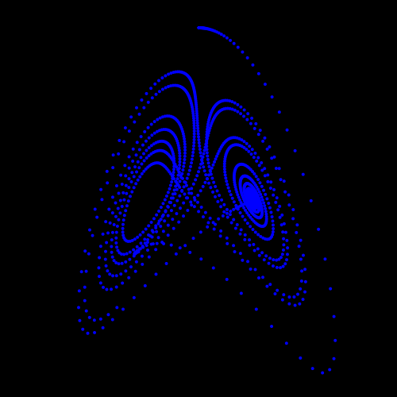

# Lorenz Strange Attractor in Java
The chaotic weather butterfly effect discovered by Edward Lorenz.

## Description
This is a simple implementation in Java of a Lorenz Strange Attractor. <br>
It makes all the calculations for 1500 iteration steps and then generates an SVG file of the trajectory. <br>
Lorenz discovered in 1963 the butter fly effect while studying the weather models by simplifying the equations to it's simplest form that would generate a chaotic system.

## Trajectory image for the first 1500 steps, with a step of 0.01 and initial conditions of x=0.1 y=0 z=0


## Lorenz strange attractor differential equations.
```
       Fixed parameters:
       sigma = 10
       rho   = 28
       beta  = 8/3

       Equations:
       dx / dt = sigma * ( y - x)
       dy / dt = x * (rho - z) - y
       dz / dt = x * y - beta * z
```

## From Wikipedia
"The Lorenz system is a system of ordinary differential equations first studied by Edward Lorenz. It is notable for having chaotic solutions for certain parameter values and initial conditions. In particular, the Lorenz attractor is a set of chaotic solutions of the Lorenz system. In popular media the 'butterfly effect' stems from the real-world implications of the Lorenz attractor, i.e. that in any physical system, in the absence of perfect knowledge of the initial conditions (even the minuscule disturbance of the air due to a butterfly flapping its wings), our ability to predict its future course will always fail. This underscores that physical systems can be completely deterministic and yet still be inherently unpredictable even in the absence of quantum effects. The shape of the Lorenz attractor itself, when plotted graphically, may also be seen to resemble a butterfly." 

## References
* [Lorenz System (Wikipedia)](https://en.wikipedia.org/wiki/Lorenz_system)
* [Butterfly effect (wikipedia)](https://en.wikipedia.org/wiki/Butterfly_effect)
* [Programming the Lorenz Attractor](https://www.algosome.com/articles/lorenz-attractor-programming-code.html)

## License
MIT Open Source License

## Have fun!
Best regards, <br>
Joao Nuno Carvalho
